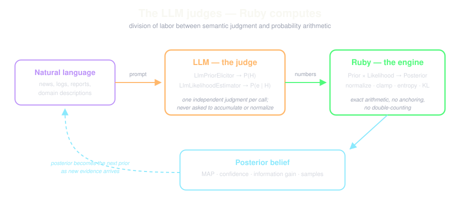

# Bayesian Inference × LLMs — an Exploration

This document maps the intersection between this library's Bayesian
machinery and large language models, and records what has been built
and verified so far.

## The Core Insight

LLMs and Bayes' theorem have exactly complementary failure modes:

| | Semantic judgment | Probability arithmetic |
|---|---|---|
| **LLM** | excellent — can assess "how surprising is this log line if the DB were down?" | poor — anchors, double-counts evidence, drifts toward its first conclusion |
| **This library** | none — KDE needs numeric feature vectors | exact — normalization, entropy, KL divergence, sequential updates |

So the design rule for every experiment here:

> **The LLM judges. Ruby computes.**
> Ask the LLM only for isolated, independent judgments (a weight, a
> conditional probability). Never ask it to accumulate, normalize, or
> update beliefs — that is Bayes' job, done in Ruby.



## Pattern 1: LLM as Prior Elicitor (built ✅)

The eternal objection to Bayesian methods is "where does the prior come
from?" An LLM is a queryable compression of domain knowledge — exactly
the thing a prior is supposed to encode.

`LlmPriorElicitor` takes a natural-language situation description and
the outcome set, asks the LLM for relative weights, then floors,
normalizes, and validates them through the existing `Prior` class.

```ruby
elicitor = BayesianInference::LlmPriorElicitor.new(
  outcomes: [-2, -1, 0, 1, 2],
  outcome_descriptions: { -2 => 'strong downtrend', ..., 2 => 'strong uptrend' }
)
prior = elicitor.elicit("The Fed unexpectedly cut rates by 50bp...")
```

**Verified result** (`examples/04_llm_elicited_prior.rb`, gemini-2.5-flash):
with only 5 training observations, the data-only posterior was a dead
tie between "sideways" and "mild uptrend" (0.358 each). The LLM read
the bullish market context, produced a prior peaked at +1/+2, and the
informed posterior broke the tie: mild uptrend at 50.0%, confidence up
from 19.9% to 30.1%. As real data accumulates, the KDE likelihood
dominates and the influence of the elicited prior correctly fades.

**When it matters:** cold starts, regime changes, and any small-data
setting — precisely where KDE is weakest.

## Pattern 2: LLM as Likelihood Function (built ✅)

`Likelihood` (KDE) requires numeric features and history. But much
evidence is text: log lines, incident reports, witness statements.
`LlmLikelihoodEstimator` asks the LLM one narrow question per
(evidence, hypothesis) pair — *"assuming H is true, how probable is
this evidence?"* — and Ruby chains the updates:

```
posterior_n ∝ P(evidence_n | H) × posterior_{n-1}
```

Likelihoods are clamped to [0.001, 0.999] so an overconfident LLM can
never zero out a hypothesis in one step (Cromwell's rule), which is
what keeps later contradicting evidence able to reverse the belief.

**Verified result** (`examples/05_llm_likelihood_diagnosis.rb`): a
production-outage diagnosis over three hypotheses. After evidence 1–2,
`bad_deploy` led at 78.8%. Evidence 3 ("rollback didn't help") and 4
("cross-AZ ping 1ms → 900ms") cleanly reversed the belief; final
posterior: `network` at 99.96%. Information gain per update ranged
0.025–0.959 bits — the engine also tells you *which evidence mattered*.

A single LLM asked to track the same five facts in prose typically
anchors on the deploy story. Externalizing the belief state into a
posterior removes that failure mode entirely.

## Patterns Not Yet Built (future experiments)

1. **Bayesian calibration of LLM outputs** — treat the LLM as a noisy
   sensor with a measured confusion matrix P(LLM says j | truth is i),
   estimated from a labeled set. Then an LLM classification becomes a
   likelihood column and Bayes yields *calibrated* posteriors instead
   of the LLM's overconfident self-reported probabilities.
2. **Self-consistency as sampling** — query the LLM k times at
   temperature > 0 and treat the answers as draws; update a Dirichlet
   posterior over the answer distribution. Gives error bars on LLM
   judgments and a principled stopping rule ("stop sampling when the
   95% credible interval no longer overlaps").
3. **Bandwidth/hyperparameter elicitation** — let an LLM read a
   dataset description and suggest KDE bandwidth and outcome coding,
   closing the last manual knob in `TimeSeriesPredictor`.
4. **Posterior narration** — the inverse direction: hand the LLM a
   posterior + KL trail and have it write the incident-report
   paragraph. Zero math risk, pure language work.

## Engineering Notes

- **New files:** `lib/bayesian_inference/llm_support.rb` (JSON
  extraction, re-keying, normalization, clamping — all module
  functions, testable in isolation), `llm_prior_elicitor.rb`,
  `llm_likelihood_estimator.rb`.
- **Dependency discipline:** `ruby_llm` is required lazily inside
  `LlmSupport.build_chat`, so the core math library still loads without
  it. Both classes accept an injectable `chat:` object; the test suite
  (`FakeChat` in `test/test_helper.rb`) runs with zero network calls.
- **Provider selection — local first:** `LlmSupport.resolve_provider`
  auto-detects, in order: LM Studio via `ruby_llm-providers-lms`
  (`http://localhost:1234/v1`), Apfel / Apple Foundation Models via
  `ruby_llm-providers-apfel` (`http://127.0.0.1:11434/v1`), then cloud.
  `BI_LLM_PROVIDER` (`lms` | `apfel` | `cloud`) and `BI_LLM_MODEL`
  override detection. For local servers, `choose_local_model` prefers
  qwen models (they honor JSON prompts most reliably in LM Studio),
  then gpt-oss, skipping embedding/OCR models. Both local paths are
  verified: qwen3.8-27b via LM Studio gave a bullish prior peaked at
  +1; Apple's 3B on-device model gave a more cautious prior peaked
  at 0 — model quality shows up directly as prior sharpness. Note: as
  of 2026-09-18 the `ANTHROPIC_API_KEY` in this machine's environment
  returns 401; the OpenAI key has no credits; the Gemini key works.
- **Ruby 4 note:** `logger` is no longer a default gem; it is in the
  Gemfile because `ruby_llm` 1.16 requires it.
- **Test suite:** 56 runs, 0 failures (33 pre-existing + 23 new).
  `test_helper.rb` now does `Object.include(DebugMe)` — the lib classes
  call `debug_me` and previously only the examples included it, so the
  suite could not run under `rake test`.
