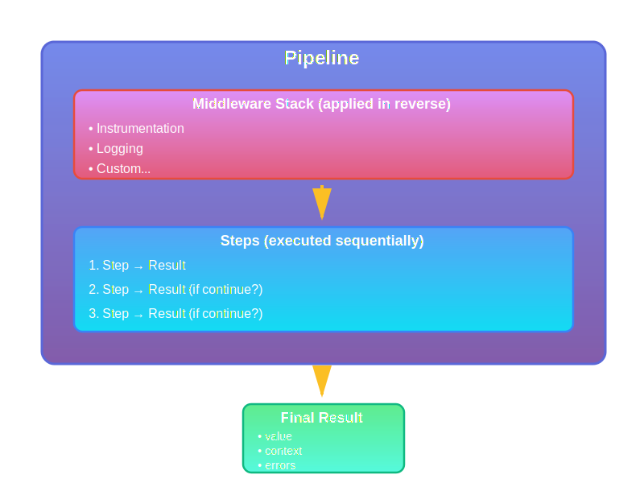

# SimpleFlow

[](https://www.ruby-lang.org/en/)
[](LICENSE)

A lightweight, modular Ruby framework for building composable data processing pipelines with middleware support, flow control, and DAG-based execution.

## Features

- ✨ **Immutable Results** - All result objects are immutable, promoting safer concurrent operations
- 🔗 **Pipeline Composition** - Combine pipelines using the `>>` operator
- 🎯 **Named Steps** - Every step has a name for better debugging and tracking
- 🚦 **Flow Control** - Built-in halt/continue mechanisms for conditional execution
- 📊 **DAG-Based Execution** - Dependency-based step ordering with parallel execution support
- 🔌 **Middleware Support** - Cross-cutting concerns like logging, instrumentation, and retries
- 🏗️ **Structured Errors** - Rich error objects with severity levels and context
- ⚡ **Parallel Execution** - Run independent steps concurrently for better performance
- 🧩 **Conditional Steps** - Execute steps only when conditions are met
- 🎨 **Clean DSL** - Intuitive domain-specific language for pipeline definition

## Table of Contents

- [Installation](#installation)
- [Quick Start](#quick-start)
- [Core Concepts](#core-concepts)
  - [Results](#results)
  - [Pipelines](#pipelines)
  - [Steps](#steps)
  - [Middleware](#middleware)
  - [DAG Pipelines](#dag-pipelines)
- [Usage Examples](#usage-examples)
- [API Reference](#api-reference)
- [Testing](#testing)
- [Development](#development)
- [Contributing](#contributing)
- [License](#license)

## Installation

Add this line to your application's Gemfile:

```ruby
gem 'simple_flow'
```

And then execute:

```bash
$ bundle install
```

Or install it yourself as:

```bash
$ gem install simple_flow
```

## Quick Start

```ruby
require 'simple_flow'

# Create a simple pipeline
pipeline = SimpleFlow::Pipeline.new do
  step :parse, ->(result) {
    result.continue(result.value.strip.upcase)
  }

  step :validate, ->(result) {
    if result.value.empty?
      result.halt.with_error(:validation, "Input cannot be empty")
    else
      result.continue(result.value)
    end
  }

  step :process, ->(result) {
    result.continue("Processed: #{result.value}")
  }
end

# Execute the pipeline
result = pipeline.call(SimpleFlow::Result.new("  hello world  "))

puts result.value    # => "Processed: HELLO WORLD"
puts result.success? # => true
```

## Core Concepts

### Results

Results are immutable value objects that flow through the pipeline. They encapsulate:

- **Value**: The data being processed
- **Context**: Metadata and contextual information
- **Errors**: Structured error objects with severity levels
- **Continue flag**: Whether execution should continue

```ruby
result = SimpleFlow::Result.new(42)
  .with_context(:user_id, 123)
  .with_error(:validation, "Warning message", severity: :warning)

result.value      # => 42
result.context    # => {:user_id => 123}
result.success?   # => true (warnings don't fail)
result.continue?  # => true
```

#### Result Methods

- `continue(new_value)` - Continue with updated value
- `halt(new_value = nil)` - Stop execution
- `with_context(key, value)` - Add context metadata
- `with_error(key, message, severity:, exception:)` - Add structured error
- `success?` - Check if successful (no errors, continuing)
- `failure?` - Check if failed (halted or has errors)
- `critical_errors?` - Check for critical-level errors

### Pipelines

Pipelines orchestrate step execution with middleware support.

```ruby
pipeline = SimpleFlow::Pipeline.new(name: :my_pipeline) do
  # Add middleware (applied to all steps)
  use_middleware SimpleFlow::Middleware::Logging
  use_middleware SimpleFlow::Middleware::Instrumentation

  # Add steps
  step :parse, ->(result) { result.continue(parse(result.value)) }
  step :validate, ->(result) { result.continue(validate(result.value)) }
  step :process, ->(result) { result.continue(process(result.value)) }
end

result = pipeline.call(SimpleFlow::Result.new(input))
```

#### Pipeline Composition

```ruby
validation = SimpleFlow::Pipeline.new do
  step :check_format, ->(r) { r.continue(check(r.value)) }
end

processing = SimpleFlow::Pipeline.new do
  step :transform, ->(r) { r.continue(transform(r.value)) }
end

# Compose pipelines
full_pipeline = validation >> processing
```

#### Conditional Steps

```ruby
pipeline = SimpleFlow::Pipeline.new do
  step_if :apply_discount,
          ->(result) { result.value > 100 }, # condition
          ->(result) { result.continue(result.value * 0.9) } # action
end
```

### Steps

Steps are the building blocks of pipelines. Each step is a named, callable operation.

```ruby
# Simple lambda step
step :simple, ->(result) { result.continue(result.value + 1) }

# Step with options
step :tracked, ->(result) { ... }, track_duration: true

# Conditional step
step_if :optional, ->(r) { r.value > 10 }, ->(r) { ... }
```

Steps automatically:
- Track which step is currently executing
- Handle exceptions and convert to error results
- Support duration tracking
- Provide rich debugging information

### Middleware

Middleware wraps steps to add cross-cutting functionality.

#### Built-in Middleware

**Logging**
```ruby
use_middleware SimpleFlow::Middleware::Logging, level: :info
```

**Instrumentation**
```ruby
use_middleware SimpleFlow::Middleware::Instrumentation, api_key: "key"
```

**Retry**
```ruby
use_middleware SimpleFlow::Middleware::Retry,
                max_attempts: 3,
                backoff: 2,
                on_retry: ->(result, attempt, error) { ... }
```

#### Custom Middleware

```ruby
class MyMiddleware
  def initialize(callable, **options)
    @callable = callable
    @options = options
  end

  def call(result)
    # Before step execution
    result = @callable.call(result)
    # After step execution
    result
  end
end

use_middleware MyMiddleware, option: value
```

Or use a Proc:

```ruby
my_middleware = ->(callable) {
  ->(result) {
    # wrap the call
    callable.call(result)
  }
}

use_middleware my_middleware
```

### DAG Pipelines

DAG (Directed Acyclic Graph) Pipelines execute steps based on dependency relationships, enabling parallel execution.

```ruby
dag = SimpleFlow::DagPipeline.new do
  step :fetch_user, ->(r) { r.continue(fetch_user(r.value)) }

  # These can run in parallel after fetch_user completes
  step :fetch_posts, ->(r) { r.continue(fetch_posts(r.value)) },
    depends_on: :fetch_user

  step :fetch_comments, ->(r) { r.continue(fetch_comments(r.value)) },
    depends_on: :fetch_user

  # This runs after both posts and comments are fetched
  step :combine, ->(r) { r.continue(combine(r.value)) },
    depends_on: [:fetch_posts, :fetch_comments]
end

# Execute serially (respecting dependencies)
result = dag.call(initial_result)

# Execute with parallelism
result = dag.call_parallel(initial_result, max_threads: 4)
```

#### DAG Features

**Execution Order**
```ruby
dag.sorted_steps # => [:fetch_user, :fetch_posts, :fetch_comments, :combine]
```

**Parallel Groups**
```ruby
dag.parallel_groups
# => [
#   [:fetch_user],
#   [:fetch_posts, :fetch_comments],  # Can run in parallel
#   [:combine]
# ]
```

**Subgraph Extraction**
```ruby
# Get only the steps needed for a specific step
sub = dag.subgraph(:combine)
sub.sorted_steps # => [:fetch_user, :fetch_posts, :fetch_comments, :combine]
```

**DAG Merging**
```ruby
dag1 = SimpleFlow::DagPipeline.new { ... }
dag2 = SimpleFlow::DagPipeline.new { ... }
merged = dag1.merge(dag2)
```

**Circular Dependency Detection**
```ruby
# Automatically detects and raises CircularDependencyError
dag = SimpleFlow::DagPipeline.new do
  step :a, ->(r) { r }, depends_on: :b
  step :b, ->(r) { r }, depends_on: :a  # Error!
end
```

## Architecture

SimpleFlow's architecture follows a layered pipeline pattern with middleware support:

<div align="center">
  
</div>

**Key Components:**

1. **Pipeline** - Orchestrates the entire execution flow
2. **Middleware Stack** - Applied in reverse order, wraps each step with cross-cutting concerns
3. **Steps** - Execute sequentially, each receiving and returning a Result
4. **Result** - Immutable value object containing data, context, and errors

**Design Patterns:**

- **Pipeline Pattern**: Sequential processing with short-circuit capability
- **Decorator Pattern**: Middleware wraps steps to add behavior
- **Immutable Value Object**: Results are never modified, only copied with changes
- **Builder Pattern**: Fluent DSL for pipeline configuration
- **Chain of Responsibility**: Each step can handle or pass along the result
- **Async/Await**: Fiber-based concurrency for I/O-bound operations

## Usage Examples

### Basic Pipeline

```ruby
pipeline = SimpleFlow::Pipeline.new do
  step :parse, ->(result) {
    result.continue(result.value.strip.upcase)
  }

  step :validate, ->(result) {
    if result.value.length < 3
      result.halt.with_error(:validation, "Too short", severity: :error)
    else
      result.continue(result.value)
    end
  }

  step :process, ->(result) {
    result.continue("Processed: #{result.value}")
  }
end

result = pipeline.call(SimpleFlow::Result.new("  hello  "))
```

### Error Handling

```ruby
result = pipeline.call(SimpleFlow::Result.new("x"))

if result.failure?
  result.all_errors.each do |error|
    puts "#{error.severity}: #{error.message}"
  end
end
```

### Parallel DAG Execution

```ruby
dag = SimpleFlow::DagPipeline.new do
  step :init, ->(r) { r.continue(r.value) }

  # These run in parallel
  step :task_a, ->(r) { r.continue(slow_operation_a(r.value)) },
    depends_on: :init
  step :task_b, ->(r) { r.continue(slow_operation_b(r.value)) },
    depends_on: :init

  step :merge, ->(r) { r.continue(merge_results(r)) },
    depends_on: [:task_a, :task_b]
end

result = dag.call_parallel(SimpleFlow::Result.new(input))
```

### Middleware Stack

```ruby
pipeline = SimpleFlow::Pipeline.new do
  use_middleware SimpleFlow::Middleware::Logging
  use_middleware SimpleFlow::Middleware::Instrumentation, api_key: "key"
  use_middleware SimpleFlow::Middleware::Retry, max_attempts: 3

  step :process, ->(result) { result.continue(process(result.value)) }
end
```

For more examples, see the `examples/` directory:
- [`examples/basic_usage.rb`](examples/basic_usage.rb) - Basic pipeline operations
- [`examples/dag_usage.rb`](examples/dag_usage.rb) - DAG pipelines and parallel execution
- [`examples/middleware_usage.rb`](examples/middleware_usage.rb) - Middleware examples

## API Reference

### SimpleFlow::Result

- `initialize(value, context: {}, errors: {}, continue: true)`
- `continue(new_value)` → Result
- `halt(new_value = nil)` → Result
- `with_context(key, value)` → Result
- `merge_context(hash)` → Result
- `with_error(key, message, severity: :error, exception: nil)` → Result
- `continue?` → Boolean
- `success?` → Boolean
- `failure?` → Boolean
- `errors?` → Boolean
- `critical_errors?` → Boolean
- `all_errors` → Array\<ExecutionError\>
- `warnings` → Array\<ExecutionError\>
- `to_h` → Hash

### SimpleFlow::Pipeline

- `initialize(name: nil, &config)`
- `use_middleware(middleware, **options)` → self
- `step(name, callable = nil, **options, &block)` → self
- `step_if(name, condition, callable = nil, **options, &block)` → self
- `call(result)` → Result
- `compose(other)` → Pipeline (alias: `>>`)
- `subpipeline(*step_names)` → Pipeline
- `find_step(name)` → Step|nil
- `size` → Integer
- `step_names` → Array\<Symbol\>

### SimpleFlow::DagPipeline

Inherits from Pipeline, adds:

- `step(name, callable = nil, depends_on: nil, **options, &block)` → self
- `call(result)` → Result
- `call_parallel(result, max_threads: 4)` → Result
- `sorted_steps` → Array\<Symbol\>
- `parallel_groups` → Array\<Array\<Symbol\>\>
- `subgraph(step_name)` → DagPipeline
- `merge(other)` → DagPipeline

### Middleware

- `SimpleFlow::Middleware::Logging.new(callable, logger: nil, level: :info)`
- `SimpleFlow::Middleware::Instrumentation.new(callable, collector: nil, api_key: nil)`
- `SimpleFlow::Middleware::Retry.new(callable, max_attempts: 3, backoff: 2, retryable_errors: [StandardError], on_retry: nil)`

## Testing

Run the test suite:

```bash
rake test
```

Run with verbose output:

```bash
rake test_verbose
```

Run specific test file:

```bash
ruby test/simple_flow/pipeline_test.rb
```

## Development

After checking out the repo:

```bash
bundle install
```

Run tests:

```bash
rake test
```

Open an interactive console:

```bash
rake console
```

## Key Improvements Over Original

This refactored version includes significant enhancements:

1. **Fixed Immutability Bug** - `Result#halt` now correctly returns a new instance
2. **DAG-Based Execution** - Inspired by [Dagwood](https://github.com/madbomber/dagwood), supports dependency-based ordering and parallel execution
3. **Named Steps** - All steps have names for better debugging
4. **Structured Errors** - Rich `ExecutionError` objects with severity levels
5. **Pipeline Composition** - Combine pipelines with `>>`
6. **Conditional Steps** - `step_if` for conditional execution
7. **Retry Middleware** - Automatic retries with exponential backoff
8. **Enhanced Testing** - Comprehensive test suite with 80+ tests
9. **Better Documentation** - Full API reference and examples
10. **Gem Structure** - Proper Ruby gem packaging

## Inspiration

- **Dagwood** ([github.com/madbomber/dagwood](https://github.com/madbomber/dagwood)) - DAG-based dependency resolution
- **Rack** - Middleware pattern
- **Dry-rb** - Railway-oriented programming concepts

## Contributing

Bug reports and pull requests are welcome on GitHub.

## License

The gem is available as open source under the terms of the [MIT License](LICENSE).
