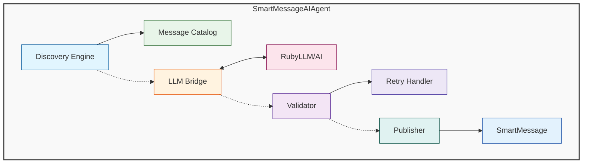

# SmartMessage AI Agent Pattern Experiment

## Overview

The AgentSupport pattern enables AI-powered agents to dynamically discover, select, and use SmartMessage classes for communication based on contextual scenarios. This pattern combines the structured messaging capabilities of SmartMessage with the intelligent decision-making of Large Language Models (LLMs).

## Core Concepts

### 1. Message Discovery
The agent introspects available SmartMessage classes at runtime, building a catalog of messaging capabilities. Each message class provides:
- A description of its purpose
- Property descriptions with validation constraints
- Valid value enumerations

### 2. AI-Driven Message Selection
When faced with a scenario, the agent:
- Presents all available message types to the LLM
- Provides scenario context
- Receives the most appropriate message class selection

### 3. Intelligent Property Generation
The LLM generates valid property values by:
- Understanding property descriptions and constraints
- Considering the scenario context
- Respecting validation rules (enums, formats, required fields)

### 4. Validation Recovery
If message validation fails, the agent:
- Parses validation errors
- Provides error context to the LLM
- Regenerates only the invalid properties
- Retries up to a configured limit

## Architecture



## Implementation Pattern

### Base Class: SmartMessageAIAgent

```ruby
class SmartMessageAIAgent
  def initialize(service_name, logger = nil)
    @service_name = service_name
    @logger = logger
    setup_ai
  end

  # Core workflow
  def send_message_for_scenario(scenario)
    available_messages = discover_message_types
    selected_class = select_message_type(available_messages, scenario)
    publish_with_retry(selected_class, scenario)
  end

  # Override points for customization
  def message_module; end
  def include_message_class?(klass); end
  def build_selection_context(scenario); end
  def build_property_context(scenario, klass); end
  def generate_fallback_values(klass, scenario); end
end
```

### Creating Custom AI Agents

```ruby
class EmergencyResponseAgent < SmartMessageAIAgent
  def initialize
    super('emergency_agent')
  end

  # Only use emergency-related messages
  def include_message_class?(message_class)
    message_class.to_s.include?('Emergency')
  end

  # Provide domain context
  def build_selection_context(scenario)
    "Emergency situation: #{scenario[:description]}"
  end

  # Domain-specific fallbacks
  def generate_fallback_values(message_class, scenario)
    super.merge({
      'severity' => 'high',
      'response_required' => true
    })
  end
end
```

## Key Features

### 1. Dynamic Message Discovery
- Runtime introspection of available message types
- No hardcoded message dependencies
- Automatically adapts to new message classes

### 2. Contextual Message Selection
- LLM analyzes scenario and available options
- Selects most semantically appropriate message
- Falls back to keyword matching if AI unavailable

### 3. Intelligent Property Population
- LLM understands property descriptions
- Respects validation constraints
- Generates contextually appropriate values

### 4. Self-Healing Validation
- Parses validation errors
- Extracts valid value constraints
- Retries with corrected values

### 5. Graceful Degradation
- Works without AI using fallback logic
- Keyword-based message selection
- Predefined property templates

## Usage Examples

### Basic Usage
```ruby
agent = SmartMessageAIAgent.new('my_agent')

scenario = {
  type: 'emergency',
  description: 'Fire detected in building',
  context: 'Smoke sensors triggered in multiple rooms'
}

message = agent.send_message_for_scenario(scenario)
```

### Custom Agent for Monitoring
```ruby
class MonitoringAgent < SmartMessageAIAgent
  def initialize
    super('monitor_agent')
    @monitoring_targets = []
  end

  def include_message_class?(klass)
    # Only health and status messages
    klass.to_s.match?(/Health|Status|Alert/)
  end

  def monitor_service(service_name)
    scenario = {
      type: 'health_check',
      description: "Checking health of #{service_name}",
      target: service_name
    }
    send_message_for_scenario(scenario)
  end
end

monitor = MonitoringAgent.new
monitor.monitor_service('database')
```

### Agent with Custom AI Provider
```ruby
class CustomAIAgent < SmartMessageAIAgent
  def configure_rubyllm
    RubyLLM.configure do |config|
      # Use specific AI provider
      config.default_model = 'claude-3-opus'
      config.anthropic_api_key = ENV['ANTHROPIC_KEY']
      config.request_timeout = 30
    end
  end
end
```

## Benefits

1. **Flexibility**: Agents adapt to available message types without code changes
2. **Intelligence**: LLM provides semantic understanding of scenarios
3. **Robustness**: Validation retry with AI assistance
4. **Extensibility**: Easy to create domain-specific agents
5. **Resilience**: Fallback logic when AI is unavailable

## Best Practices

### 1. Message Documentation
Ensure all SmartMessage classes have:
- Clear class-level descriptions
- Detailed property descriptions
- Validation messages that explain constraints

### 2. Scenario Design
Structure scenarios consistently:
```ruby
scenario = {
  type: 'category',           # General type
  description: 'details',      # Human-readable description
  context: 'full context',     # Additional context for AI
  # Domain-specific fields...
}
```

### 3. Fallback Values
Always provide sensible fallback values:
- Cover all required properties
- Use safe defaults
- Match expected validation constraints

### 4. Error Handling
Implement proper error handling:
- Log all AI interactions
- Handle network failures gracefully
- Provide meaningful error messages

### 5. Testing
Test both AI and fallback paths:
- Mock LLM responses for testing
- Verify fallback selection logic
- Test validation retry mechanism

## Integration with City Scenario

The visitor.rb program demonstrates this pattern in action:
1. Discovers all emergency message types
2. Observes city scenarios (fires, crimes, etc.)
3. Selects appropriate emergency messages
4. Generates realistic incident reports
5. Publishes to emergency services

This pattern enables creating a ecosystem of intelligent agents that can communicate using the full vocabulary of available SmartMessage types, adapting dynamically as new message types are added to the system.

## Future Enhancements

1. **Message Learning**: Agents could learn from successful/failed message attempts
2. **Context Memory**: Maintain conversation context across multiple messages
3. **Multi-Agent Coordination**: Agents negotiating message protocols
4. **Semantic Routing**: AI-driven message routing based on content understanding
5. **Automatic Message Design**: LLM generating new message class definitions
