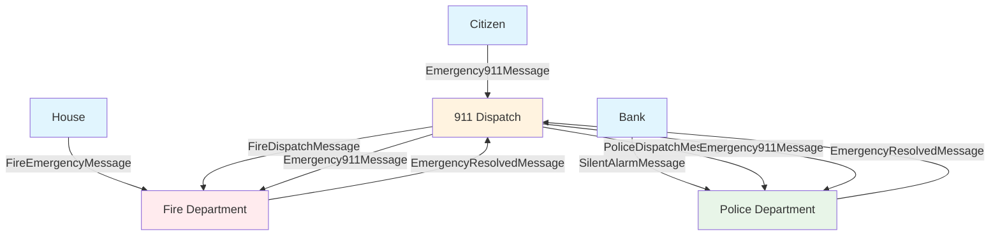
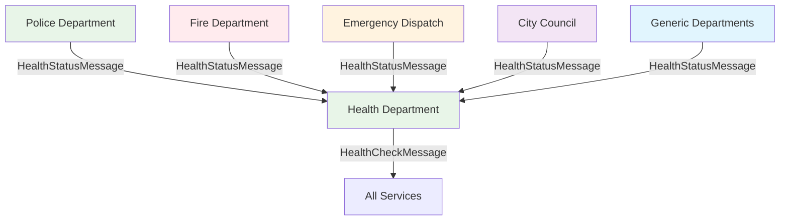
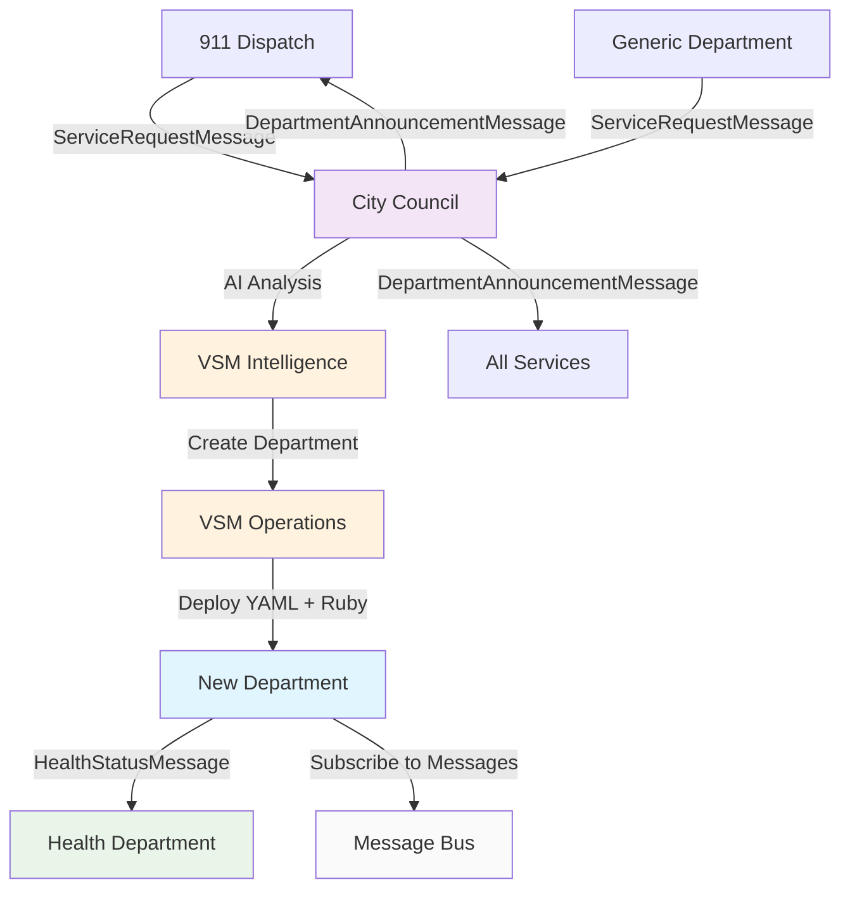
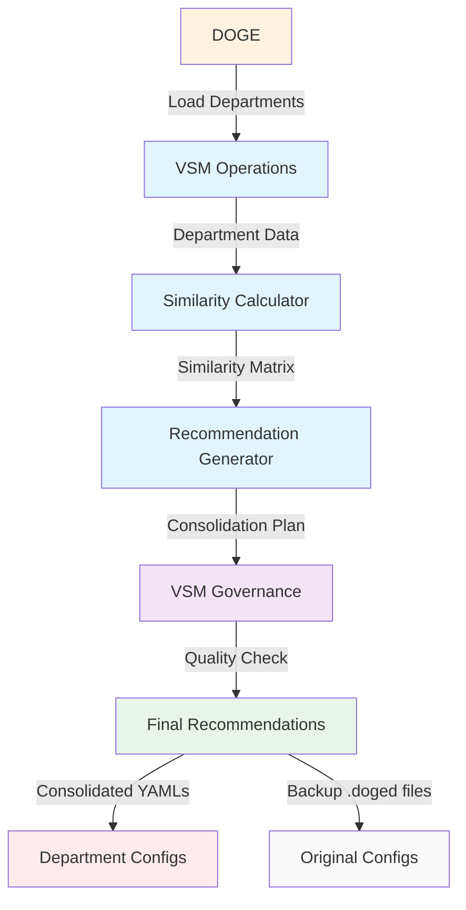

# City Scenario - SmartMessage & VSM Simulation

This is an experiment in using the Ruby gems `smart_message` and `vsm` to implement a city scenario as a demonstration of **async multi-process distributed simulations**. This city scenario is tailored specifically for **macOS** and the **iTerm2** terminal application.

## Overview

This simulation demonstrates a complete city emergency response system with dynamic department creation capabilities. The system uses Redis pub/sub messaging through the `smart_message` library for inter-service communication, and the `vsm` (Vector Symbolic Memory) library for AI-driven department analysis and creation.

## Control Scripts

Three main scripts control the simulation:

- **`start_demo.sh`** - Launches all services in separate iTerm2 tabs
- **`stop_demo.sh`** - Terminates all running city services 
- **`de_doge.sh`** - Removes consolidated departments and restores original configurations

## Major Components

### Core Emergency Services
- **Emergency Dispatch Center (911)** - Central routing hub for all emergency calls
- **Police Department** - Handles crimes, accidents, and security incidents
- **Fire Department** - Responds to fires, medical emergencies, and rescues
- **Health Department** - Monitors city health status and provides periodic health checks

### Dynamic Government
- **City Council** (VSM-powered) - Dynamically creates new departments based on service requests
- **DOGE (Department of Government Efficiency)** (VSM-powered) - Analyzes and consolidates similar departments

### Incident Generators
- **Citizens** - Generate various emergency 911 calls
- **Houses** - Can trigger fire emergencies  
- **Local Bank** - Generates silent alarms for police
- **Visitors** - Out-of-town visitors who may need city services

### Support Services
- **Generic Department** - Template-based department that runs from YAML configurations
- **Redis Monitor** - Real-time message traffic visualization
- **Redis Statistics** - Performance metrics dashboard

## Smart Message Library Usage

### Message Types

All components communicate via these `smart_message` message types:

1. **`Emergency911Message`** - Citizens to 911 dispatch
2. **`FireEmergencyMessage`** - Houses to Fire Department
3. **`FireDispatchMessage`** - 911 to Fire Department
4. **`PoliceDispatchMessage`** - 911 to Police Department
5. **`SilentAlarmMessage`** - Bank to Police Department
6. **`ServiceRequestMessage`** - Departments requesting new services from City Council
7. **`DepartmentAnnouncementMessage`** - City Council announcing new departments
8. **`HealthCheckMessage`** - Health Department broadcasting health checks
9. **`HealthStatusMessage`** - Services responding with their health status
10. **`EmergencyResolvedMessage`** - Departments notifying resolution of incidents

### Publisher/Subscriber Patterns

Each service acts as both publisher and subscriber:

- **Publishers**: Generate messages when events occur (emergencies, status updates, etc.)
- **Subscribers**: Listen for specific message types and respond accordingly
- **Message Routing**: Uses Redis pub/sub with topic-based routing via `from` and `to` headers

## VSM Library Usage

The Vector Symbolic Memory (VSM) library powers the AI-driven components:

### Components Using VSM:

1. **City Council (`city_council.rb`)**
   - **Intelligence System**: AI-powered department creation using LLM integration
   - **Operations System**: Tools for department template generation and deployment
   - **Governance System**: Validates department configurations and manages policies

2. **DOGE (`doge_vsm.rb`)**
   - **Intelligence System**: AI analysis for department consolidation recommendations
   - **Operations System**: Similarity analysis tools and consolidation generators  
   - **Governance System**: Validates consolidation quality and enforces efficiency standards

## Message Flow Diagrams

### Emergency Response Flow



### Health Monitoring Flow



### Dynamic Department Creation Flow



### DOGE Efficiency Analysis Flow



## Architecture Features

### Smart Message Benefits
- **Asynchronous Communication**: All services communicate without blocking
- **Location Transparency**: Services don't need to know where other services are running
- **Dynamic Routing**: Messages route based on service names and patterns
- **Serialization**: Automatic JSON serialization/deserialization
- **Type Safety**: Strongly typed message schemas with validation

### VSM Integration Benefits  
- **AI-Driven Decisions**: LLM integration for intelligent department creation
- **Tool-Based Architecture**: Modular operations that can be tested and reused
- **Policy Governance**: Built-in quality checks and validation rules
- **Async Processing**: Non-blocking AI analysis and operations
- **Extensible Design**: Easy to add new analysis tools and workflows

### Distributed Simulation Features
- **Multi-Process**: Each service runs as independent Ruby process
- **Scalable**: Can run multiple instances of any service
- **Fault Tolerant**: Services continue running if others fail
- **Observable**: Real-time monitoring via Redis Monitor and Statistics
- **Dynamic**: New services can be created and deployed during runtime

## Getting Started

### Prerequisites
- macOS (for iTerm2 integration)
- Ruby 3.x
- Redis server running locally
- iTerm2 terminal application

### Quick Start
```bash
# Start the complete simulation
./start_demo.sh

# Monitor message traffic (in separate terminal)
ruby redis_monitor.rb

# Stop all services
./stop_demo.sh
```

### Running Individual Components
```bash
# Core services
ruby emergency_dispatch_center.rb
ruby city_council.rb
ruby fire_department.rb  
ruby police_department.rb
ruby health_department.rb

# Incident generators
ruby citizen.rb "John Smith" auto
ruby house.rb "123 Main Street"
ruby local_bank.rb

# YAML-configured departments
ruby generic_department.rb water_management_department
ruby generic_department.rb animal_control_department

# AI analysis tools
ruby doge_vsm.rb
```

This simulation demonstrates how `smart_message` and `vsm` can work together to create sophisticated, AI-enhanced distributed systems with dynamic service creation capabilities.