# CityCouncil Documentation

## Dynamic City Service Generation System

The CityCouncil program acts as the governing body for the city simulation, capable of dynamically creating and persisting new city service departments as they are requested. It uses the Vector Symbolic Memory (VSM) architecture integrated with SmartMessage for inter-service communication and AI-powered decision making.

## Purpose and Goals

### Why CityCouncil Exists
1. **Dynamic Service Creation**: Automatically generates new city departments when emergency services are needed but don't exist
2. **Service Governance**: Monitors and manages the health of all city departments
3. **Intelligent Response**: Uses AI to understand service requests and determine appropriate department specifications
4. **Self-Healing Architecture**: Automatically restarts failed departments and maintains service availability

### What It Does
- Discovers and catalogs existing city departments (both Ruby and YAML-based)
- Listens for service requests via SmartMessage
- Analyzes requests using AI to determine if new services are needed
- Generates department configurations and launches new services
- Monitors department health and automatically restarts failed services
- Provides a unified governance layer for all city services

### How It Works
- VSM architecture provides five subsystems: Identity, Intelligence, Operations, Governance, and Coordination
- SmartMessage enables publish/subscribe communication between services
- AI (via RubyLLM) analyzes requests and generates department specifications
- Generic department template allows configuration-driven service creation
- Health monitoring ensures service reliability through automatic recovery

## System Architecture


## Data Flow Diagram


## Control Flow Diagram

```mermaid
flowchart TD
    Entry([Program Start]) --> CheckCLI{CLI Mode?}
    CheckCLI -->|Yes| StartCLI[Start CLI Thread]
    CheckCLI -->|No| AsyncContext[Enter Async Context]
    StartCLI --> AsyncContext
    
    AsyncContext --> CreateBase[Create Base Instance]
    CreateBase --> InitLogger[Initialize Logger]
    InitLogger --> SetSignals[Setup Signal Handlers]
    SetSignals --> DiscoverDepts[Discover Departments]
    
    DiscoverDepts --> BuildVSM[Build VSM Capsule]
    BuildVSM --> CreateIdentity[Create Identity<br/>• city_council<br/>• Must serve citizens<br/>• Create needed services<br/>• Maintain operations]
    CreateIdentity --> CreateGov[Create Governance]
    CreateGov --> CreateCoord[Create Coordination]
    CreateCoord --> CreateIntel[Create Intelligence<br/>with Council Reference]
    CreateIntel --> CreateOps[Create Operations<br/>with Council Reference]
    CreateOps --> SetupVSMSubs[Setup VSM Bus Subscriptions]
    
    SetupVSMSubs --> SetupSMSubs[Setup SmartMessage Subscriptions]
    SetupSMSubs --> SubServiceReq[Subscribe to ServiceRequestMessage]
    SubServiceReq --> SubHealthCheck[Subscribe to HealthCheckMessage]
    SubHealthCheck --> SubHealthStatus[Subscribe to HealthStatusMessage]
    
    SubHealthStatus --> StartGovLoop[Start Governance Loop]
    
    subgraph "Main Governance Loop"
        GovLoop[Governance Loop] --> MonitorOps[Monitor City Operations]
        MonitorOps --> CheckNewDepts[Check for New Departments]
        CheckNewDepts --> UpdateStatus[Update Health Status]
        UpdateStatus --> Sleep10[Sleep 10 seconds]
        Sleep10 --> GovLoop
    end
    
    subgraph "Message Handlers"
        MsgReceived[Message Received] --> RouteMsg{Route by Type}
        
        RouteMsg -->|ServiceRequest| HandleService[Handle Service Request<br/>→ Forward to Intelligence]
        RouteMsg -->|HealthCheck| HandleHealth[Respond with Health Status]
        RouteMsg -->|HealthStatus| HandleDeptHealth[Forward to Operations<br/>Update Department Health]
        RouteMsg -->|VSM create_service| HandleCreate[Operations - Create Service]
        RouteMsg -->|VSM:assistant| LogAssistant[Log AI Response]
        
        HandleService --> IntelProcess[Intelligence Analysis]
        IntelProcess --> CheckNeed2{New Service Needed?}
        CheckNeed2 -->|Yes| GenSpec2[Generate Specification]
        CheckNeed2 -->|No| ReturnFalse[Return False]
        
        GenSpec2 --> EmitCreate2[Emit create_service]
        EmitCreate2 --> HandleCreate
        
        HandleCreate --> OpsProcess[Operations - Create and Launch]
        OpsProcess --> AnnounceResult[Announce Success/Failure]
    end
    
    subgraph "Signal Handlers"
        SigReceived[SIGINT/SIGTERM] --> Cleanup[Cleanup Departments]
        Cleanup --> TermProcs[Terminate All Processes]
        TermProcs --> Exit[Exit Program]
    end
    
    StartGovLoop --> GovLoop
    StartGovLoop --> MsgReceived
    GovLoop --> SigReceived
```



## Intelligence Component Flow

```mermaid
flowchart TD
    IntelMsg[Message Received] --> CheckKind{Message Kind?}
    CheckKind -->|service_request| ProcessReq[Process Service Request]
    CheckKind -->|user| ProcessReq
    CheckKind -->|other| ReturnFalse[Return False]
    
    ProcessReq --> NeedsService{Needs New Service?}
    NeedsService -->|No| LogNoService[Log No Service Needed]
    LogNoService --> ReturnFalse2[Return False]
    
    NeedsService -->|Yes| AnalyzeReq[Analyze Service Request]
    AnalyzeReq --> PrepPrompt[Prepare AI Prompt]
    PrepPrompt --> CallAI[Call AI Provider]
    CallAI --> ParseResponse[Parse AI Response]
    ParseResponse --> ExtractSpec[Extract Service Specification]
    
    ExtractSpec --> ValidSpec{Valid Spec?}
    ValidSpec -->|No| EmitError[Emit Error Message]
    ValidSpec -->|Yes| CheckExists2{Service Exists?}
    
    CheckExists2 -->|Yes| EmitExists[Emit Already Exists]
    CheckExists2 -->|No| CreateMsg[Create create_service Message]
    
    CreateMsg --> EmitToVSM[Emit to VSM Bus]
    EmitToVSM --> EmitSuccess[Emit Success Message]
    
    EmitError --> ReturnTrue[Return True]
    EmitExists --> ReturnTrue
    EmitSuccess --> ReturnTrue
    
    subgraph "AI Analysis Details"
        AIPrompt[System Prompt<br/>Analyze emergency request<br/>Generate department spec] --> AIModel[AI Model<br/>GPT-4 or Ollama]
        AIModel --> JSONResponse[JSON Response:<br/>• name<br/>• description<br/>• responsibilities<br/>• message_types]
    end
    
    PrepPrompt --> AIPrompt
    AIModel --> ParseResponse
```



## Operations Component Flow

```mermaid
flowchart TD
    OpsMsg[Operations Message] --> CheckOpsKind{Message Kind?}
    CheckOpsKind -->|create_service| HandleCreateSvc[Handle Create Service]
    CheckOpsKind -->|manage_department| HandleManage[Handle Department Management]
    CheckOpsKind -->|other| ReturnFalse3[Return False]
    
    HandleCreateSvc --> ExtractSpec2[Extract Service Spec]
    ExtractSpec2 --> GenOpID[Generate Operation ID]
    GenOpID --> CreateFromTemplate[Create Department from Template]
    
    CreateFromTemplate --> CheckTemplate{Template Exists?}
    CheckTemplate -->|No| LogError[Log Template Error]
    CheckTemplate -->|Yes| GenYAMLConfig[Generate YAML Configuration]
    
    GenYAMLConfig --> WriteConfig[Write Config File]
    WriteConfig --> PrepLaunch[Prepare Launch Command]
    PrepLaunch --> SpawnProcess[Spawn Ruby Process]
    SpawnProcess --> DetachProcess[Detach from Parent]
    DetachProcess --> Wait2Sec[Wait 2 Seconds]
    Wait2Sec --> CheckAlive{Process Alive?}
    
    CheckAlive -->|No| AnnounceFail[Announce Failure]
    CheckAlive -->|Yes| RegisterMon[Register for Monitoring]
    
    RegisterMon --> AnnounceCreate[Announce Created]
    AnnounceCreate --> AnnounceLaunch[Announce Launched]
    AnnounceLaunch --> RegisterCouncil[Register with Council]
    RegisterCouncil --> ReturnTrue2[Return True]
    
    AnnounceFail --> ReturnFalse4[Return False]
    LogError --> ReturnFalse4
    
    subgraph "Configuration Generation"
        DeptSpec[Department Spec] --> ConfigGen[Generate Config<br/>• department metadata<br/>• capabilities<br/>• message_types<br/>• routing_rules<br/>• message_actions<br/>• action_configs]
        ConfigGen --> YAMLFile[department_name.yml]
    end
    
    subgraph "Health Monitoring Thread"
        MonThread[Monitor Thread] --> Loop10Sec[Loop Every 10s]
        Loop10Sec --> CheckHealth{Time for Health Check?}
        CheckHealth -->|Yes| ForEachMon[For Each Department]
        CheckHealth -->|No| Loop10Sec
        
        ForEachMon --> CheckProcHealth[Check Process Health]
        CheckProcHealth --> SendHealthMsg[Send Health Check]
        SendHealthMsg --> HandleTimeout[Handle Response Timeout]
        HandleTimeout --> NextDept[Next Department]
        NextDept --> ForEachMon
        
        ForEachMon --> CleanupDead2[Cleanup Dead Departments]
        CleanupDead2 --> Loop10Sec
    end
    
    ExtractSpec2 --> DeptSpec
    RegisterMon --> MonThread
```



## Message Bus Architecture


## Department Lifecycle


## Data Structures

### Service Specification
```ruby
{
  name: "animal_control",                    # Department identifier (without _department suffix)
  display_name: "Animal Control",            # Human-readable name
  description: "Handles animal-related emergencies...", # Purpose description
  responsibilities: [                        # List of capabilities
    "Respond to animal attacks",
    "Handle stray animals",
    "Investigate animal bites"
  ],
  message_types: [                          # Messages to publish
    "animal_incident_report",
    "animal_control_dispatch"
  ]
}
```

### Department Health Info
```ruby
{
  pid: 12345,                               # Process ID
  department_file: "animal_control_department.rb", # Executable file
  process_healthy: true,                    # Process exists
  responsive: true,                         # Responds to health checks
  process_failures: 0,                      # Failed process checks
  health_check_failures: 0,                 # Failed health responses
  restart_count: 0,                         # Times restarted
  status: 'running',                        # Current status
  created_at: Time,                         # Creation timestamp
  last_process_check: Time,                 # Last process check
  last_health_request: Time,                # Last health request sent
  last_failure: Time,                       # Last failure time
  last_restart: Time,                       # Last restart time
  awaiting_response: false                  # Waiting for health response
}
```

### Department YAML Configuration
```yaml
department:
  name: animal_control_department
  display_name: Animal Control
  description: Handles animal-related emergencies
  invariants:
  - serve citizens efficiently
  - respond to emergencies promptly
  - maintain operational readiness

capabilities:
- Respond to animal attacks
- Handle stray animals
- Investigate animal bites

message_types:
  subscribes_to:
  - health_check_message
  - emergency_911_message
  publishes:
  - animal_incident_report

routing_rules:
  emergency_911_message:
  - condition: message contains relevant keywords
    keywords: [animal, attack, bite, stray, rabid]
    priority: high
  health_check_message:
  - condition: always
    priority: normal

message_actions:
  emergency_911_message: handle_emergency
  health_check_message: respond_health_check

action_configs:
  handle_emergency:
    response_template: "🚨 ANIMAL_CONTROL: Responding to {{emergency_type}} at {{location}}"
    additional_actions: [log_emergency, notify_dispatch]
    publish_response: true
  respond_health_check:
    response_template: "💗 animal_control_department is operational"
    publish_response: true

logging:
  level: info
  statistics_interval: 300
```

## Key Features

### 1. Dynamic Service Generation
- AI analyzes emergency requests to determine service needs
- Automatically generates department specifications
- Creates YAML configurations from templates
- Launches new departments as separate processes

### 2. VSM Architecture Integration
- **Identity**: Defines CityCouncil's purpose and invariants
- **Intelligence**: AI-powered request analysis and decision making
- **Operations**: Handles actual department creation and management
- **Governance**: Enforces policies and quality standards
- **Coordination**: Manages workflow between components

### 3. Health Monitoring & Recovery
- Monitors department process health every 30 seconds
- Sends health check messages and tracks responses
- Automatically restarts failed departments (up to 3 attempts)
- Removes permanently failed departments from monitoring

### 4. SmartMessage Integration
- Subscribes to service requests from emergency dispatch
- Publishes department announcements for system-wide awareness
- Handles health check/status message exchanges
- Enables asynchronous communication between all city services

### 5. Template-Based Department Creation
- Uses `generic_department.rb` as configurable template
- Generates department-specific YAML configurations
- Extracts keywords from descriptions for message routing
- Creates appropriate message handlers and action configs

## Usage

### Starting CityCouncil
```bash
# Basic mode
ruby city_council.rb

# With interactive CLI
ruby city_council.rb --cli
```

### Environment Variables
```bash
# Set AI provider (default: openai)
export LLM_PROVIDER=ollama
export LLM_MODEL=llama3.2:1b

# Enable debug output
export VSM_DEBUG_STREAM=1
```

### Example Service Request Flow
1. Emergency dispatch sends ServiceRequestMessage: "Need animal control for rabid dog"
2. CityCouncil Intelligence analyzes request
3. Determines "animal_control_department" is needed but doesn't exist
4. Generates service specification with capabilities
5. Operations creates YAML configuration
6. Launches new department process
7. Announces creation to all services
8. Begins health monitoring of new department

## Integration Points

### With Emergency Services
- Receives service requests when departments are missing
- Creates specialized departments based on emergency needs
- Ensures comprehensive emergency response coverage

### With Generic Department Template
- Uses template as base for all new departments
- Passes department name as argument for configuration loading
- Enables rapid deployment of new services

### With VSM Framework
- Leverages VSM's component architecture for separation of concerns
- Uses VSM message bus for internal component communication
- Benefits from VSM's async processing capabilities

### With SmartMessage System
- Integrates with city-wide messaging infrastructure
- Enables real-time communication with all departments
- Supports health monitoring across the entire system

## Benefits

1. **Self-Healing**: Automatically recovers from department failures
2. **Adaptive**: Creates new services as city needs evolve
3. **Intelligent**: Uses AI to understand and fulfill service requests
4. **Observable**: Comprehensive logging and health monitoring
5. **Scalable**: Can manage unlimited number of departments
6. **Maintainable**: Clear separation of concerns through VSM architecture

This documentation provides a comprehensive understanding of the CityCouncil system's architecture, data flows, and operational patterns for dynamic city service generation and management.