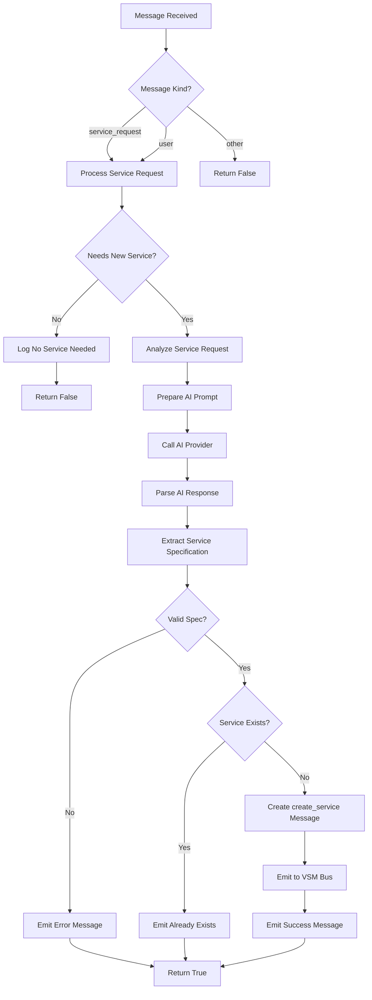

```mermaid
flowchart TD
    IntelMsg[Message Received] --> CheckKind{Message Kind?}
    CheckKind -->|service_request| ProcessReq[Process Service Request]
    CheckKind -->|user| ProcessReq
    CheckKind -->|other| ReturnFalse[Return False]
    
    ProcessReq --> NeedsService{Needs New Service?}
    NeedsService -->|No| LogNoService[Log No Service Needed]
    LogNoService --> ReturnFalse2[Return False]
    
    NeedsService -->|Yes| AnalyzeReq[Analyze Service Request]
    AnalyzeReq --> PrepPrompt[Prepare AI Prompt]
    PrepPrompt --> CallAI[Call AI Provider]
    CallAI --> ParseResponse[Parse AI Response]
    ParseResponse --> ExtractSpec[Extract Service Specification]
    
    ExtractSpec --> ValidSpec{Valid Spec?}
    ValidSpec -->|No| EmitError[Emit Error Message]
    ValidSpec -->|Yes| CheckExists2{Service Exists?}
    
    CheckExists2 -->|Yes| EmitExists[Emit Already Exists]
    CheckExists2 -->|No| CreateMsg[Create create_service Message]
    
    CreateMsg --> EmitToVSM[Emit to VSM Bus]
    EmitToVSM --> EmitSuccess[Emit Success Message]
    
    EmitError --> ReturnTrue[Return True]
    EmitExists --> ReturnTrue
    EmitSuccess --> ReturnTrue
```